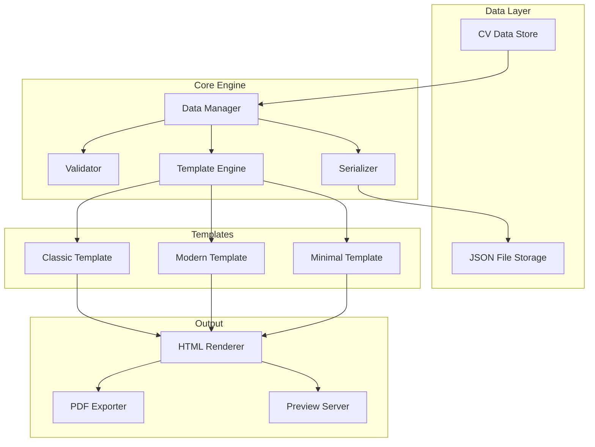

# Design Document

## Overview

ATS CV Generator, kullanıcıların CV bilgilerini merkezi bir JSON veri yapısında yönetmelerini ve bu verileri ATS uyumlu şablonlarda otomatik olarak render etmelerini sağlayan bir TypeScript/Node.js uygulamasıdır. Sistem, veri değişikliklerini izleyerek tüm aktif şablonları otomatik günceller.

## Architecture



## Components and Interfaces

### 1. CVData Interface

```typescript
interface PersonalInfo {
  name: string;
  email: string;
  phone: string;
  location: string;
  linkedin?: string;
  website?: string;
}

interface WorkExperience {
  id: string;
  company: string;
  title: string;
  startDate: string; // YYYY-MM format
  endDate: string | "present";
  description: string[];
  location?: string;
}

interface Education {
  id: string;
  institution: string;
  degree: string;
  field: string;
  startDate: string;
  endDate: string;
  gpa?: string;
}

interface Skill {
  name: string;
  category: "technical" | "soft" | "language" | "other";
  level?: "beginner" | "intermediate" | "advanced" | "expert";
}

interface CVData {
  personalInfo: PersonalInfo;
  summary?: string;
  workExperience: WorkExperience[];
  education: Education[];
  skills: Skill[];
  certifications?: string[];
  projects?: Project[];
}
```

### 2. DataManager

Merkezi veri yönetimi ve değişiklik bildirimi sağlar.

```typescript
interface DataManager {
  load(filePath: string): Promise<CVData>;
  save(filePath: string): Promise<void>;
  update(section: keyof CVData, data: any): void;
  addEntry(section: "workExperience" | "education", entry: any): void;
  removeEntry(section: "workExperience" | "education", id: string): void;
  onChange(callback: (data: CVData) => void): void;
}
```

### 3. Validator

Veri doğrulama işlemlerini gerçekleştirir.

```typescript
interface ValidationResult {
  valid: boolean;
  errors: ValidationError[];
}

interface ValidationError {
  field: string;
  message: string;
  type: "required" | "format" | "range";
}

interface Validator {
  validate(data: CVData): ValidationResult;
  validateEmail(email: string): boolean;
  validateDateRange(start: string, end: string): boolean;
}
```

### 4. TemplateEngine

Şablon render işlemlerini yönetir.

```typescript
type TemplateName = "classic" | "modern" | "minimal";

interface TemplateEngine {
  render(data: CVData, template: TemplateName): string;
  renderAll(data: CVData): Map<TemplateName, string>;
  getAvailableTemplates(): TemplateName[];
}
```

### 5. Exporter

Çıktı formatlarını üretir.

```typescript
interface ExportOptions {
  template: TemplateName;
  format: "html" | "pdf";
  outputPath: string;
}

interface Exporter {
  exportHTML(html: string, options: ExportOptions): Promise<string>;
  exportPDF(html: string, options: ExportOptions): Promise<string>;
  generateFileName(name: string, template: TemplateName, format: string): string;
}
```

## Data Models

### CV Data JSON Schema

```json
{
  "$schema": "http://json-schema.org/draft-07/schema#",
  "type": "object",
  "required": ["personalInfo", "workExperience", "education", "skills"],
  "properties": {
    "personalInfo": {
      "type": "object",
      "required": ["name", "email", "phone", "location"],
      "properties": {
        "name": { "type": "string", "minLength": 1 },
        "email": { "type": "string", "format": "email" },
        "phone": { "type": "string" },
        "location": { "type": "string" }
      }
    },
    "workExperience": {
      "type": "array",
      "items": {
        "type": "object",
        "required": ["id", "company", "title", "startDate", "endDate"],
        "properties": {
          "id": { "type": "string" },
          "company": { "type": "string" },
          "title": { "type": "string" },
          "startDate": { "type": "string", "pattern": "^\\d{4}-\\d{2}$" },
          "endDate": { "type": "string" }
        }
      }
    }
  }
}
```


## Correctness Properties

*A property is a characteristic or behavior that should hold true across all valid executions of a system-essentially, a formal statement about what the system should do. Properties serve as the bridge between human-readable specifications and machine-verifiable correctness guarantees.*

### Property 1: Serialization Round Trip
*For any* valid CVData object, serializing to JSON and then deserializing should produce an equivalent CVData object with all field values and data types preserved exactly.
**Validates: Requirements 2.1, 2.2, 2.3**

### Property 2: Valid CV Data Storage
*For any* valid personal information, work experience, or education entry, adding it to CVData should result in the data being retrievable with identical values.
**Validates: Requirements 1.1, 1.2, 1.3, 1.5**

### Property 3: Skill Categorization Consistency
*For any* skill with a specified category, storing and retrieving the skill should preserve its category assignment.
**Validates: Requirements 1.4**

### Property 4: Template Rendering Completeness
*For any* valid CVData and any template, the rendered HTML output should contain all non-empty sections from the CVData (personal info, experiences, education, skills).
**Validates: Requirements 3.2, 4.2**

### Property 5: Section Removal Exclusion
*For any* CVData, when a section is removed, the rendered output for all templates should not contain any content from the removed section.
**Validates: Requirements 4.3**

### Property 6: ATS Compliance
*For any* rendered template output, the HTML should not contain tables, images, or complex CSS that would break ATS parsing.
**Validates: Requirements 3.3**

### Property 7: Valid HTML Output
*For any* valid CVData and any template, the rendered output should be valid HTML with proper structure (html, head, body tags).
**Validates: Requirements 3.4, 5.1**

### Property 8: Filename Pattern Compliance
*For any* export operation with a given name, template, and format, the generated filename should match the pattern "{name}_{template}_{date}.{format}".
**Validates: Requirements 5.3**

### Property 9: Required Field Validation
*For any* CVData missing a required field (name, email, phone, location for personal info; company, title, dates for experience), validation should return an error specifying the missing field.
**Validates: Requirements 7.1, 7.2**

### Property 10: Date Range Validation
*For any* date range where end date is before start date, validation should return a date range error.
**Validates: Requirements 7.3**

### Property 11: Email Format Validation
*For any* string that does not match email format (missing @, invalid domain), validation should return a format error.
**Validates: Requirements 7.4**

### Property 12: Invalid JSON Schema Rejection
*For any* JSON that does not conform to the CVData schema, deserialization should fail with a validation error.
**Validates: Requirements 2.4**

## Error Handling

### Error Types

```typescript
enum CVErrorType {
  VALIDATION_ERROR = "VALIDATION_ERROR",
  SERIALIZATION_ERROR = "SERIALIZATION_ERROR",
  TEMPLATE_ERROR = "TEMPLATE_ERROR",
  EXPORT_ERROR = "EXPORT_ERROR",
  FILE_ERROR = "FILE_ERROR"
}

interface CVError {
  type: CVErrorType;
  message: string;
  field?: string;
  details?: any;
}
```

### Error Handling Strategy

1. **Validation Errors**: Tüm doğrulama hataları toplanır ve tek bir ValidationResult olarak döndürülür
2. **Serialization Errors**: JSON parse/stringify hataları yakalanır ve anlamlı mesajlarla sarmalanır
3. **Template Errors**: Şablon render hataları loglanır ve fallback template kullanılır
4. **Export Errors**: Dosya yazma hataları kullanıcıya bildirilir

## Testing Strategy

### Unit Testing

- Jest framework kullanılacak
- Her component için ayrı test dosyası
- Mock kullanımı minimize edilecek

### Property-Based Testing

- **Library**: fast-check
- **Minimum iterations**: 100 per property
- Her property testi, design document'taki ilgili property'yi referans alacak

### Test Structure

```
src/
├── __tests__/
│   ├── dataManager.test.ts
│   ├── validator.test.ts
│   ├── validator.property.test.ts
│   ├── templateEngine.test.ts
│   ├── templateEngine.property.test.ts
│   ├── serializer.test.ts
│   ├── serializer.property.test.ts
│   └── exporter.test.ts
```

### Property Test Annotation Format

Her property-based test şu formatta annotate edilecek:
```typescript
// **Feature: ats-cv-generator, Property 1: Serialization Round Trip**
```

