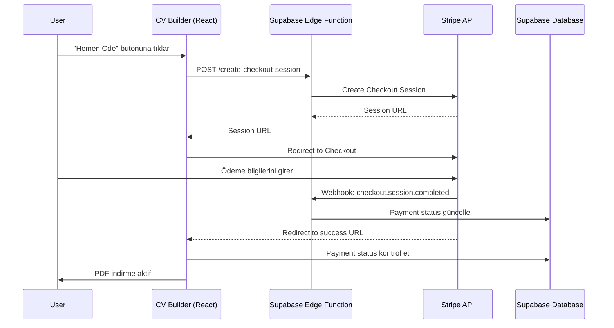

# Design Document

## Overview

Bu tasarım, CV Builder uygulamasına Stripe ödeme entegrasyonu ekler. Stripe Checkout kullanılarak kullanıcılar güvenli bir şekilde PDF indirme özelliği için ödeme yapabilecektir. Entegrasyon, frontend'de Stripe.js ve backend'de Supabase Edge Functions kullanacaktır.

## Architecture



## Components and Interfaces

### 1. Stripe Service (`web/src/lib/stripe.ts`)

```typescript
interface StripeConfig {
  publishableKey: string;
}

interface CheckoutSessionRequest {
  priceAmount: number;
  userEmail?: string;
  successUrl: string;
  cancelUrl: string;
}

interface CheckoutSessionResponse {
  sessionId: string;
  url: string;
}

// Functions
function initStripe(): Promise<Stripe | null>
function createCheckoutSession(request: CheckoutSessionRequest): Promise<CheckoutSessionResponse>
function redirectToCheckout(sessionId: string): Promise<void>
```

### 2. Payment Modal Update (`web/src/components/PaymentModal.tsx`)

```typescript
interface PaymentModalProps {
  isOpen: boolean;
  onClose: () => void;
  onPaymentSuccess: () => void;
  price?: number;
  userEmail?: string;
}

// Updated to integrate with Stripe Checkout
```

### 3. Supabase Edge Function (`supabase/functions/create-checkout-session`)

```typescript
// Deno Edge Function
interface RequestBody {
  priceAmount: number;
  userEmail?: string;
  successUrl: string;
  cancelUrl: string;
  userId?: string;
}

// Creates Stripe Checkout Session and returns URL
```

### 4. Webhook Handler (`supabase/functions/stripe-webhook`)

```typescript
// Handles Stripe webhook events
// Updates payment status in database
```

### 5. Database Service Update (`web/src/lib/database.ts`)

```typescript
interface PaymentRecord {
  id: string;
  user_id?: string;
  session_id: string;
  email: string;
  amount: number;
  currency: string;
  status: 'pending' | 'completed' | 'failed';
  created_at: string;
  completed_at?: string;
}

// Functions
function createPaymentRecord(payment: Partial<PaymentRecord>): Promise<PaymentRecord>
function updatePaymentStatus(sessionId: string, status: string): Promise<void>
function getPaymentByEmail(email: string): Promise<PaymentRecord | null>
function checkPaymentStatus(email: string): Promise<boolean>
```

## Data Models

### Payments Table (Supabase)

```sql
CREATE TABLE payments (
  id UUID PRIMARY KEY DEFAULT gen_random_uuid(),
  user_id UUID REFERENCES auth.users(id),
  session_id TEXT UNIQUE NOT NULL,
  stripe_payment_intent TEXT,
  email TEXT NOT NULL,
  amount INTEGER NOT NULL,
  currency TEXT DEFAULT 'try',
  status TEXT DEFAULT 'pending' CHECK (status IN ('pending', 'completed', 'failed', 'refunded')),
  metadata JSONB DEFAULT '{}',
  created_at TIMESTAMPTZ DEFAULT NOW(),
  completed_at TIMESTAMPTZ,
  updated_at TIMESTAMPTZ DEFAULT NOW()
);

-- Index for quick lookups
CREATE INDEX idx_payments_email ON payments(email);
CREATE INDEX idx_payments_session_id ON payments(session_id);
CREATE INDEX idx_payments_status ON payments(status);

-- RLS Policies
ALTER TABLE payments ENABLE ROW LEVEL SECURITY;

CREATE POLICY "Users can view own payments" ON payments
  FOR SELECT USING (auth.uid() = user_id OR email = auth.jwt()->>'email');

CREATE POLICY "Service role can manage payments" ON payments
  FOR ALL USING (auth.role() = 'service_role');
```

### Site Settings Update

```sql
-- Add Stripe settings columns
ALTER TABLE site_settings ADD COLUMN IF NOT EXISTS stripe_publishable_key TEXT;
ALTER TABLE site_settings ADD COLUMN IF NOT EXISTS stripe_mode TEXT DEFAULT 'test';
```

## Correctness Properties

*A property is a characteristic or behavior that should hold true across all valid executions of a system-essentially, a formal statement about what the system should do. Properties serve as the bridge between human-readable specifications and machine-verifiable correctness guarantees.*

### Property 1: Price Consistency
*For any* checkout session creation request, the amount passed to Stripe SHALL equal the price configured in site settings multiplied by 100 (for kuruş conversion).
**Validates: Requirements 1.2, 3.2**

### Property 2: Payment Cancellation Preserves State
*For any* cancelled payment flow, the user's payment status SHALL remain unchanged (not granted access).
**Validates: Requirements 1.4**

### Property 3: Successful Payment Creates Record
*For any* successfully completed payment, a payment record SHALL exist in the database with status 'completed' and matching session_id.
**Validates: Requirements 2.1**

### Property 4: Payment Status Enables Feature
*For any* user with a completed payment record, the canExportPDF flag SHALL be true.
**Validates: Requirements 2.2**

### Property 5: UI Reflects Payment Status
*For any* user with active payment status, the PDF download button SHALL NOT display the price indicator.
**Validates: Requirements 2.4**

### Property 6: Webhook Updates Database
*For any* valid checkout.session.completed webhook event, the corresponding payment record SHALL be updated to 'completed' status.
**Validates: Requirements 4.1**

### Property 7: Webhook Signature Validation
*For any* webhook request with invalid signature, the handler SHALL reject the request with 400 status.
**Validates: Requirements 4.2**

### Property 8: Environment-Based Key Selection
*For any* environment configuration, the Stripe publishable key used SHALL match the configured mode (test keys for test mode, live keys for production).
**Validates: Requirements 5.1, 5.2**

## Error Handling

| Error Scenario | Handling Strategy |
|----------------|-------------------|
| Stripe API unavailable | Display user-friendly error, allow retry |
| Invalid API keys | Log error, show admin warning |
| Checkout session creation fails | Display error message, don't redirect |
| Webhook signature invalid | Return 400, log attempt |
| Database update fails | Retry with exponential backoff |
| User closes browser during payment | Webhook ensures status is updated |

## Testing Strategy

### Unit Tests
- Test price conversion (TRY to kuruş)
- Test payment status checking logic
- Test UI state based on payment status

### Property-Based Tests
- Use fast-check library for TypeScript
- Test price consistency across random price values
- Test payment status logic with random user states

### Integration Tests
- Test Stripe Checkout flow with test keys
- Test webhook handling with mock events
- Test database operations

### Manual Testing
- Complete test payment with Stripe test cards
- Verify webhook delivery in Stripe dashboard
- Test cancel flow

